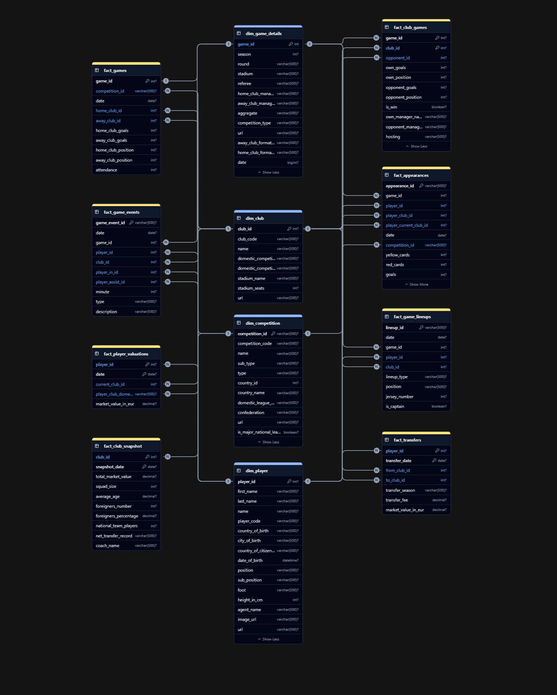
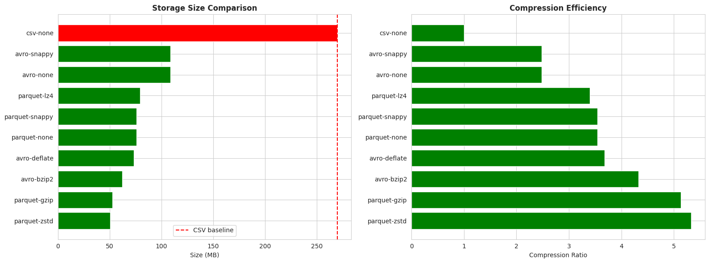
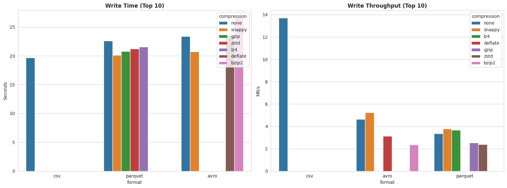

# TransferMarkt Data Warehouse - ETL & Benchmark Project

 

A comprehensive data engineering project that transforms the TransferMarkt football dataset into a star schema **data warehouse** and performs extensive **benchmarking** of storage formats (CSV, Avro, Parquet) with various compression algorithms on **Databricks** Unity Catalog.

## 📊 Project Overview

This project demonstrates end-to-end data warehousing best practices:

- **Data Modeling**: Star schema with 4 dimensions and 8 fact tables
- **ETL Pipeline**: PySpark-based transformation from raw CSV to dimensional model
- **Performance Benchmarking**: Comprehensive analysis of:
  - Storage formats (CSV, Avro, Parquet)
  - Compression algorithms (Snappy, Gzip, LZ4, ZSTD, Bzip2, Deflate)
  - Write/Read performance metrics
- **Production-Ready DDL**: Snowflake-compatible SQL schemas with clustering keys

## Data Model

### Technology Stack

- **Platform**: Databricks Serverless + Unity Catalog
- **Processing**: Apache Spark 3.x (PySpark)
- **Storage**: Unity Catalog Volumes
- **Visualization**: Matplotlib, Seaborn
- **Target Warehouse**: Snowflake (DDL included)

## 🚀 Getting Started

You can upload `TransferMarkt_ETL_and_Benchmark.ipynb` to Databricks to run the full ETL and benchmarking process. The notebook is structured into sections for easy navigation.

## 📈 Benchmark Results

### 🏆 Winner: Parquet + ZSTD

| Metric | Result |
|--------|--------|
| Overall Score | 302.3/100 |
| Compression Ratio | 5.33x |
| Space Saved | 81.2% |
| Storage Size | 50.67 MB (vs 269.9 MB CSV) |

### Top 5 Storage Formats

| Format | Compression | Size (MB) | Compression Ratio | Space Saved |
|--------|-------------|-----------|-------------------|-------------|
| Parquet | ZSTD | 50.67 | 5.33x | 81.2% |
| Parquet | Gzip | 52.56 | 5.14x | 80.5% |
| Avro | Bzip2 | 62.37 | 4.33x | 76.9% |
| Parquet | Snappy | 76.13 | 3.55x | 71.8% |
| Parquet | LZ4 | 79.32 | 3.40x | 70.6% |

### Performance Insights

- **Best Compression**: Parquet + ZSTD (5.33x ratio)
- **Fastest Write**: Parquet + Snappy (20.77s total)
- **Fastest Read**: Parquet + ZSTD (0.85s average)
- **Best Balance**: Parquet + Snappy (general purpose)

### 📸 Visualizations

*Storage size comparison across different formats and compression algorithms*

*Write performance metrics showing throughput and execution time*

*Read performance analysis for full scans and selective queries*

## 📚 Resources
- [Project Reference](https://github.com/ahmedshaaban1999/Data_Engineering_Mentorship/tree/main/level_1/Data_Modeling/projects/ecommerce)

---

Built with ❤️ by Ali Adel - Data Engineer | [LinkedIn](https://www.linkedin.com/in/aliadel01/) 